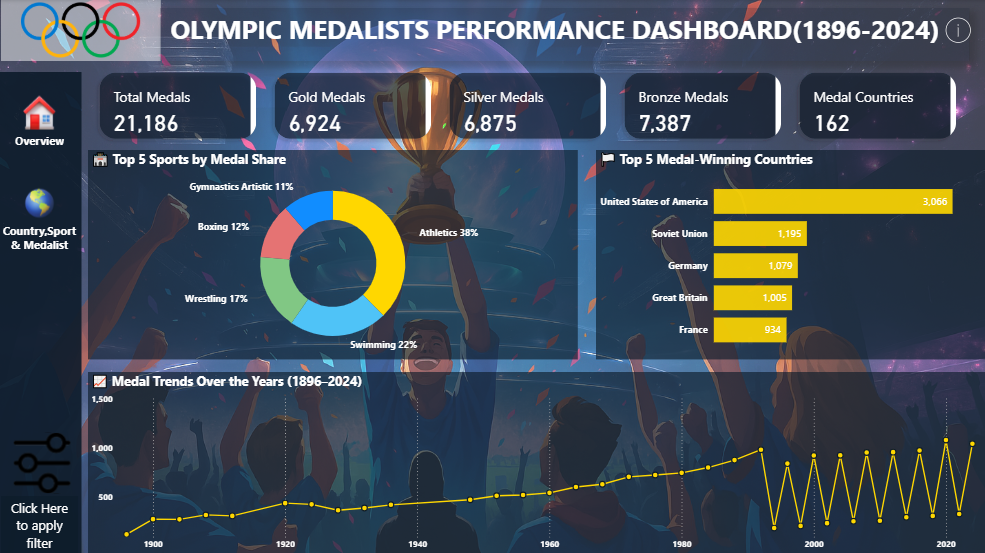
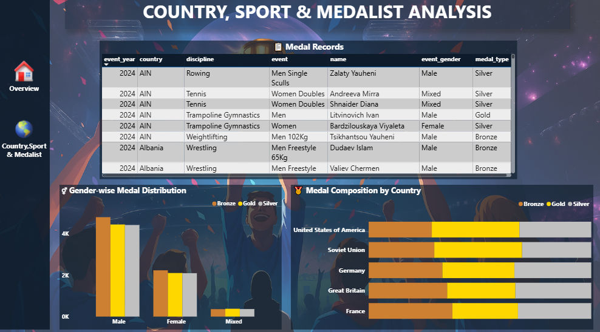

# 🏅 Olympics Medalist Performance Analysis Dashboard (1896–2024)

## 📊 Project Overview
This project presents an end-to-end data analysis of Olympic medal data using Power BI.
The dashboard highlights medal trends, country performance, sport dominance, and medalist details.

## 🛠 Tools & Technologies
- Power BI
- Power Query 
- DAX

## 🔍 Key Analysis
- Total medals and medal-type distribution
- Top medal-winning countries and sports
- Year-wise medal trends (1896–2024)
- Gender-wise medal distribution
- Country, sport & medalist-level insights

## 📁 Project Structure
- `/data` – Dataset files
- `/dashboard` – Power BI (.pbix) file
- `/screenshots` – Dashboard images

## 📸 Dashboard Preview

-  Overview Page
    
-  Country, Sport & Medalist Analysis
    

## 🚀 How to Use
1. Download the `.pbix` file
2. Open it in Power BI Desktop
3. Refresh the data if required

## 👩‍💻 Author
**Feba Thampi**  
Aspiring Data Analyst

